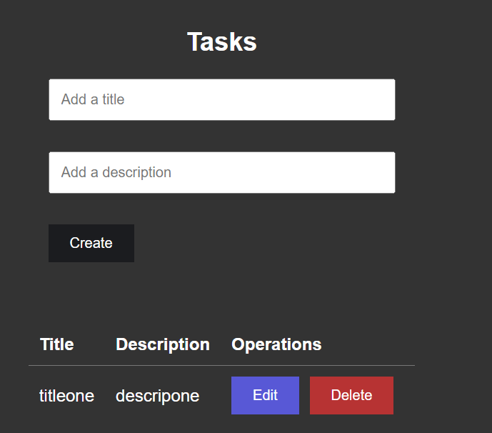
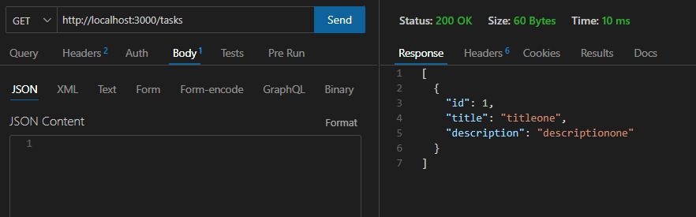
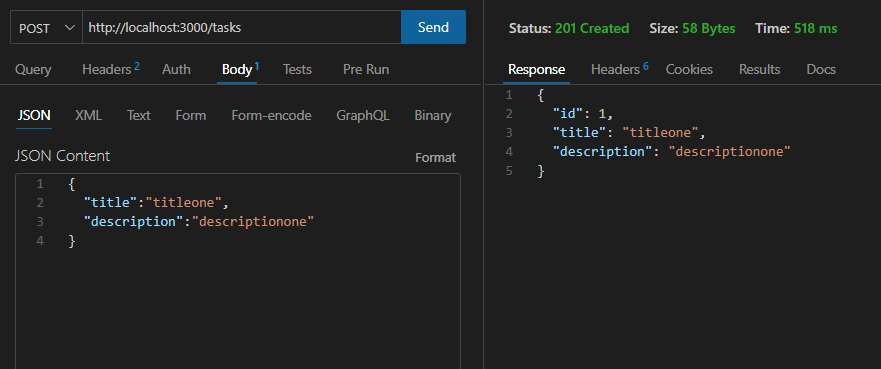
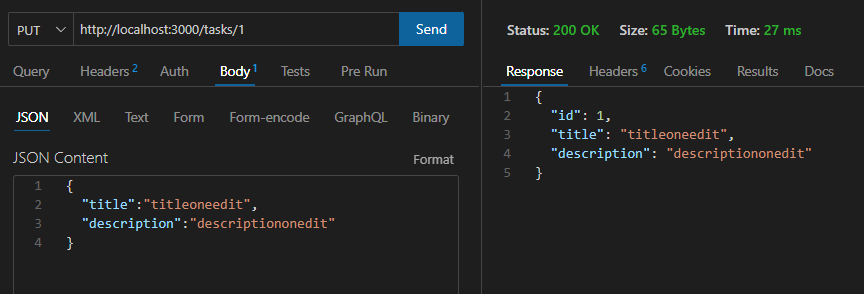
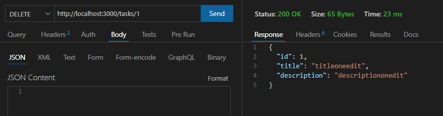

# Nestjs Prisma with React Vite create Tasks

### [Fronted React Vite](https://github.com/diegoperea20/Flask-and-React)

<p align="justify">
Nestjs framework backend Prisma ORM RESTAPI sqlite with Cors for React vite where you create title and description in sqlite.
</p>

## Activation CORS

<p align="justify">
Put in main.ts this code for activation Cors  
</p>

```bash
import { NestFactory } from '@nestjs/core';
import { AppModule } from './app.module';

async function bootstrap() {
  const app = await NestFactory.create(AppModule, { cors: true });
  await app.listen(3000);
}
bootstrap();

```

<p align="center">
  
</p>


GET
<p align="center">
  
</p>

POST
<p align="center">
  
</p>

PUT
<p align="center">
  
</p>

DELETE
<p align="center">
  
</p>


## Installation

```bash
$ npm install
```

## Running the app

```bash
# development
 #npm run start

# watch mode
 npm run start:dev

# production mode
 npm run start:prod
```

## Test

```bash
# unit tests
$ npm run test

# e2e tests
$ npm run test:e2e

# test coverage
$ npm run test:cov
```

<p align="justify">
if you get a lot of red underline because of prettier syntax and the code is good to use in  .eslintrc.js :
</p>


```bash
module.exports = {
  parser: '@typescript-eslint/parser',
  parserOptions: {
    project: 'tsconfig.json',
    tsconfigRootDir: __dirname,
    sourceType: 'module',
  },
  plugins: ['@typescript-eslint/eslint-plugin'],
  extends: [
    'plugin:@typescript-eslint/recommended',
    'plugin:prettier/recommended',
  ],
  root: true,
  env: {
    node: true,
    jest: true,
  },
  ignorePatterns: ['.eslintrc.js'],
  rules: {
    '@typescript-eslint/interface-name-prefix': 'off',
    '@typescript-eslint/explicit-function-return-type': 'off',
    '@typescript-eslint/explicit-module-boundary-types': 'off',
    '@typescript-eslint/no-explicit-any': 'off',
    'prettier/prettier': ['error', { 'endOfLine': 'auto' }],
  },
};

```


